# Digital Factory — Walkthrough

## What We've Built

An automated AI pipeline that researches market niches, generates complete digital products (reports, templates, courses, databases, prompt packs, and more), packages them, publishes to Gumroad, deploys landing pages to Vercel, promotes on social media, and syncs to Notion — all from a single CLI command.

---

## Pipeline Flow

```mermaid
flowchart TB
    subgraph Input["Input Layer"]
        A1["CLI Wizard<br/><i>interactive Typer prompts</i>"]
        A2["Batch CSV<br/><i>multi-product via --batch</i>"]
        A3["Resume Mode<br/><i>--resume from last state</i>"]
    end

    subgraph Core["Orchestrator Engine"]
        B["Orchestrator<br/><i>DAG topological sort<br/>error isolation • resumable state<br/>dynamic pipeline expansion</i>"]
        C["Product Schema<br/><i>16 JSON schemas define<br/>component DAG per product type</i>"]
        D["Job State<br/><i>JSON persistence per component<br/>enables resume on failure</i>"]
    end

    subgraph Research["Research & Planning"]
        E["market_agent<br/><i>Web • Reddit • News • Trends • GDelt<br/>Firecrawl deep scrape • competitor analysis<br/>→ market_research.json</i>"]
        F["research_agent<br/><i>legacy research agent</i>"]
    end

    subgraph Content["Content Generation"]
        G["content_agent<br/><i>LLM + Jinja2 prompt templates<br/>→ extensive Markdown</i>"]
        H["catalog_agent<br/><i>prompt/resource collections<br/>→ structured JSON catalogs</i>"]
        I["csv_export_agent<br/><i>tabular data → CSV / XLSX</i>"]
    end

    subgraph Visuals["Media & Visuals"]
        J["image_agent<br/><i>Imagen → Gemini → SVG fallback<br/>→ cover.png, thumbnail.png</i>"]
        K["visual_agent<br/><i>secondary image generation</i>"]
        L["diagram_agent<br/><i>Mermaid.js code generation<br/>→ *.mmd diagrams</i>"]
    end

    subgraph Rendering["Rendering & Formatting"]
        M["render_agent<br/><i>Markdown → Jinja2 HTML/CSS<br/>→ Playwright PDF → *.pdf</i>"]
        N["renderers/<br/><i>PlaywrightRenderer (active)<br/>AntigravityRenderer (stub)</i>"]
    end

    subgraph Quality["Quality Validation"]
        QA["evaluation_agent<br/><i>pattern checks • AI-ism detection<br/>LLM hallucination cross-ref<br/>→ quality-report.json</i>"]
        QB["review_agent<br/><i>human-in-the-loop review logs<br/>when hallucination flags found</i>"]
        QC["orchestrator/quality.py<br/><i>scoring criteria • thresholds<br/>25 AI-ism patterns</i>"]
        QD["orchestrator/notify.py<br/><i>alert dispatch • optional<br/>QUALITY_WEBHOOK_URL</i>"]
    end

    subgraph Notion["Notion Integration"]
        O["notion_schema_agent<br/><i>LLM designs database architecture<br/>→ notion_schema.json</i>"]
        P["notion_agent<br/><i>Notion API: creates databases,<br/>properties, relations, pages</i>"]
        Q["notion_content_agent<br/><i>pushes markdown as Notion blocks<br/>used in notion_only mode</i>"]
    end

    subgraph Publishing["Packaging, Publishing & Promotion"]
        R["packaging_agent<br/><i>collects all deliverables from<br/>_delivery_map → {slug}.zip</i>"]
        S["gumroad_agent<br/><i>research → sales copy → upload ZIP<br/>+ images → publish via API</i>"]
        T["landing_agent<br/><i>Design Intelligence brief →<br/>LLM HTML → Vercel deploy</i>"]
        U["social_agent<br/><i>post to Facebook / Instagram<br/>Threads / Pinterest</i>"]
    end

    subgraph DesignIntelligence["Design Intelligence"]
        V["design_intelligence/<br/><i>6 design skill rules • 12 vibes<br/>12 layout patterns • brief generator</i>"]
    end

    subgraph Outputs["Output Artifacts"]
        W1["outputs/{slug}/<br/>market_research.json"]
        W2["outputs/{slug}/<br/>content/*.md"]
        W3["outputs/{slug}/<br/>content/*.pdf"]
        W4["outputs/{slug}/<br/>assets/cover.png"]
        W5["outputs/{slug}/<br/>data/*.csv/*.xlsx"]
        W6["outputs/{slug}/<br/>{slug}.zip"]
        W7["outputs/{slug}/<br/>gumroad/published.json"]
        W8["outputs/{slug}/<br/>landing/index.html"]
    end

    A1 --> B
    A2 --> B
    A3 --> B
    B --> C
    B --> D

    B --> E
    E -->|"schema switch<br/>pipeline plan merge<br/>format recommendations"| B
    E --> F
    E --> G
    E --> H
    E --> I

    G --> J
    G --> L
    G --> M
    M --> N
    H --> M

    G -.->|"quality gate"| QA
    H -.->|"quality gate"| QA
    I -.->|"quality gate"| QA
    J -.->|"quality gate"| QA
    L -.->|"quality gate"| QA
    M -.->|"quality gate"| QA
    E -.->|"quality gate"| QA
    QA -->|"score < 0.6 → fix prompt → retry (max 2)"| G
    QA -->|"needs_human_review → log"| QB
    QA --> QC
    QA --> QD

    E --> O
    O --> P
    P --> Q

    J --> R
    G --> R
    M --> R
    I --> R
    L --> R
    Q --> R

    R --> S
    G --> T
    V --> T
    T --> U

    B --> W1
    G --> W2
    M --> W3
    J --> W4
    I --> W5
    R --> W6
    S --> W7
    T --> W8
```



---

## Execution Order (Typical Research Pack)

```
market_research ──→ images ──→ content ──→ render ──→ package
                      │                      │
                      ├── csv_export ─────────┘
                      ├── diagram ─────────────┘
                      └── catalog ─────────────┘

notion_schema ──→ notion_tree ──→ notion_content  (parallel branch)

gumroad_research ──→ gumroad_publish  (after package)
landing_page  (after content)
social_promotion  (after landing_page)
```

---

## 16 Product Schemas

| Schema | Key Path | Notion Sync |
|--------|----------|-------------|
| `discovery` | market → switch | ❌ |
| `research_pack` | market → content → render → package | optional |
| `blog_kit` | market → content → render → package | optional |
| `visual_pack` | market → image → render → package | optional |
| `saas_docs` | market → content → render → package | optional |
| `course_launch` | market → content → render → notion → package | ✅ |
| `operating_system` | market → content → render → notion → package | ✅ |
| `workflow_kit` | market → image → content → render → notion → package | ✅ |
| `database` | market → csv_export → package | optional |
| `sop_pack` | market → content → render → package | optional |
| `prompt_pack` | market → catalog → package | optional |
| `resource_pack` | market → catalog → package | optional |
| `swipe_file` | market → content → render → package | optional |
| `checklist` | market → content → render + notion | ✅ |
| `excel_template` | market → csv_export → package | optional |
| `boilerplate` | market → content → package | optional |

---

## Agents Implemented (18 total)

| Agent | File | Lines | Role |
|-------|------|-------|------|
| `market_agent` | `agents/market_agent.py` | 151 | Deep market analysis with 8 real-time data sources |
| `research_agent` | `agents/research_agent.py` | 81 | Legacy content research (fallback) |
| `content_agent` | `agents/content_agent.py` | 102 | LLM-driven Markdown content generation |
| `catalog_agent` | `agents/catalog_agent.py` | 70 | Prompt/resource catalog generation |
| `image_agent` | `agents/image_agent.py` | 299 | 3-tier image generation with SVG fallback |
| `visual_agent` | `agents/visual_agent.py` | 52 | Secondary pre-prompted image gen |
| `diagram_agent` | `agents/diagram_agent.py` | 34 | Mermaid diagram code generation |
| `render_agent` | `agents/render_agent.py` | 172 | Markdown → HTML → PDF via Playwright |
| `csv_export_agent` | `agents/csv_export_agent.py` | 71 | CSV + XLSX multi-format export |
| `packaging_agent` | `agents/packaging_agent.py` | 110 | ZIP bundling via _delivery_map |
| `evaluation_agent` | `agents/evaluation_agent.py` | 177 | Quality validation: pattern checks + LLM hallucination detection |
| `review_agent` | `agents/review_agent.py` | 73 | Human-in-the-loop review logs |
| `notion_schema_agent` | `agents/notion_schema_agent.py` | 71 | LLM-generated Notion database blueprints |
| `notion_agent` | `agents/notion_agent.py` | 566 | Notion API: databases, relations, pages |
| `notion_content_agent` | `agents/notion_content_agent.py` | 127 | Notion block content writer |
| `gumroad_agent` | `agents/gumroad_agent.py` | 720 | Research + publish via Gumroad API |
| `landing_agent` | `agents/landing_agent.py` | 204 | Design Intelligence + Vercel deploy |
| `social_agent` | `agents/social_agent.py` | 345 | Cross-platform social media promotion |

---

## Key Infrastructure

### Orchestrator (`orchestrator/orchestrator.py` — ~490 lines)
- DAG topological sort from product schema components
- Dynamic pipeline expansion: `market_agent` returns a `pipeline_plan` that adds new components
- Discovery mode: auto-detects product type from niche research
- Format recommendations: market LLM recommends CSV/XLSX per component
- Quality validation gate: auto-evaluates each agent's output, retries with fix prompt if score < 0.6
- Wizardskip-gating for optional features (landing, social, gumroad, notion)
- `notion_only` mode substitutes file-agent outputs with Notion content
- Resumable state: failed pipelines pick up from last successful component
- `_delivery_map`: built from all schema components for packaging/gumroad

### Design Intelligence (`design_intelligence/`)
- Replaces the removed StitchMCP dependency
- 6 design skill rule files (impeccable, frontend-design, frontend-design2, design-taste-frontend, gpt-taste, ui-ux-pro-max)
- 12 design vibes mapped to rule combinations
- 12 landing layout patterns from CSV
- Deterministic brief generator creates structured DesignBrief for landing agent

### LLM Client (`agents/llm_client.py`)
- Unified OpenAI SDK wrapper
- Endpoint: `opencode.ai/zen/v1` — model: `mimo-v2.5-free`
- Consistent interface for all agents

### Research Tools (`agents/research_tools.py`)
- 8 data sources: Brave Search, DuckDuckGo, Reddit, Google Trends, GDelt, Firecrawl, NewsAPI, PyTrends

### State Management (`orchestrator/state.py`)
- JSON file persistence per job
- Per-component status tracking (pending/running/done/failed/skipped)
- Enables `--resume` mode

---

## Testing (48+ tests)

```
tests/
├── test_quality.py               # 18 tests — quality checks, evaluation agent, scoring
├── test_orchestrator.py          # 12 tests — execution, isolation, pipeline plan, notion-only, delivery map, channels
├── test_agents.py                # 16 tests — all agents with mocked LLM/API
├── test_channel_base.py          # 7 tests — base channel ABC, publish result, artifact
├── test_gumroad_channel.py       # 8 tests — gumroad channel, tags, rails params
├── test_csv_export_agent.py      # 3 tests — CSV/XLSX generation
├── test_multi_format.py          # 7 tests — multi-format delivery, format recs, delivery_map
├── test_catalog_agent.py         # 1 test — prompt mode
├── test_notion_content_agent.py  # 2 tests — notion content + file fallback
└── test_schemas_phase2.py        # 9 tests — schema validation (Phase 2 schemas)
```

Run with: `pytest tests/ -v`

---

## Git History (136 commits)

All commits by Kundan Kumar on `main` branch. Development span: ~6 days with 20-30 commits/day.

Key milestones in order:
1. Initial scaffolding — project structure, `__init__.py`, basic packaging
2. PDF rendering — Playwright-based HTML→PDF with design system (base.css, cover, TOC)
3. Notion integration v2 — databases, properties, relations, sample entries
4. Landing pages — StitchMCP → Vercel landing page deployment
5. Social promotion — Facebook, Instagram, Threads, Pinterest
6. Market agent — pre-content competitive intelligence with 8 real data sources
7. Image generation — unified `image_agent` with Imagen→Gemini→SVG fallback chain
8. Gumroad publishing — full presign-upload-complete flow with rich content
9. Delivery routing — `_delivery_map`, packaging/gumroad use delivery tags
10. Pipeline plans — LLM dynamically injects new components into DAG
11. Schema expansion — 8 more product schemas (Phase 2)
12. Discovery mode — auto-detect product type from market research
13. Notion-only mode — standalone Notion template products
14. Design Intelligence — 6 design rules, 12 vibes, 12 patterns, brief generator
15. Stitch removal — removed StitchMCP dependency, replaced with Design Intelligence
16. Multi-format delivery — CSV+XLSX, format recommendations, output_paths dict
17. Cleanup — removed stitch_agent, old plans/specs
18. Channel Layer — BaseChannel ABC, GumroadChannel, channel registry
19. Offer Scoring — scoring framework with weighted metrics, offer_scoring_agent
20. Quality Validation — evaluation_agent, pattern + LLM checks, auto-retry, review_agent, alerts

---

## 52 Roadmap Items (Phase 0-2 in progress)

9 phases across: Channel Layer, Offer Scoring, Quality Validation, Analytics, Platform Expansion, Advanced Delivery, AI Improvements, Enterprise Features, Monitoring.

**Completed:** Phase 2 — Quality Validation Layer (6/6 items). P0 Items from Phase 0 and Phase 1 also in progress.
