# Digital Factory — Walkthrough

## What We've Built

An automated AI pipeline that researches market niches, generates complete digital products (reports, templates, courses, databases, prompt packs, and more), packages them, publishes via a pluggable Channel Layer (Gumroad, Etsy, Shopify, Stripe), deploys landing pages to Vercel, promotes on social media, and syncs to Notion — all from a single CLI command.

---

## Pipeline Flow

```mermaid
flowchart TB
    subgraph Input["Step 1 — Input Layer"]
        A1["CLI Wizard<br/><i>interactive Typer prompts</i>"]
        A2["Batch CSV<br/><i>multi-product via --batch</i>"]
        A3["Resume Mode<br/><i>--resume from last state</i>"]
        A4["Dry-Run Mode<br/><i>--dry-run preview DAG<br/>without execution</i>"]
    end

    subgraph Core["Orchestrator Engine"]
        B["Orchestrator<br/><i>DAG topological sort<br/>error isolation • resumable state<br/>dynamic pipeline expansion<br/>template registry • circuit breaker<br/>RunLock • RateLimiter • Bottleneck</i>"]
        C["Product Schema<br/><i>16 JSON schemas define<br/>component DAG per product type</i>"]
        D["Job State<br/><i>JSON persistence per component<br/>enables resume on failure</i>"]
    end

    subgraph Research["Step 2 — Research & Scoring"]
        E["market_agent<br/><i>Web • Reddit • News • Trends • GDelt • Etsy • Gumroad<br/>Firecrawl deep scrape • competitor analysis<br/>→ market_research.json</i>"]
        E2["offer_scoring_agent<br/><i>6 weighted metrics • deterministic scoring<br/>Etsy/Gumroad marketplace data<br/>value_tier classification<br/>→ scored_recommendations[]</i>"]
        F["research_agent<br/><i>legacy research agent</i>"]
    end

    subgraph Content["Step 3 — Content Generation"]
        G["content_agent<br/><i>LLM + Jinja2 prompt templates<br/>→ extensive Markdown</i>"]
        H["catalog_agent<br/><i>prompt/resource collections<br/>→ structured JSON catalogs</i>"]
        I["csv_export_agent<br/><i>tabular data → CSV / XLSX</i>"]
    end

    subgraph Visuals["Step 3 — Media & Visuals"]
        J["image_agent<br/><i>Imagen → Gemini → SVG fallback<br/>→ cover.png, thumbnail.png</i>"]
        K["visual_agent<br/><i>secondary image generation</i>"]
        L["diagram_agent<br/><i>Mermaid.js code generation<br/>→ *.mmd diagrams</i>"]
    end

    subgraph Rendering["Step 3 — Rendering & Formatting"]
        M["render_agent<br/><i>Markdown → Jinja2 HTML/CSS<br/>→ Playwright PDF → *.pdf</i>"]
        N["renderers/<br/><i>PlaywrightRenderer (active)<br/>AntigravityRenderer (stub)</i>"]
    end

    subgraph Quality["Step 4 — Quality Validation (cross-cutting gate)"]
        QA["evaluation_agent<br/><i>pattern checks • AI-ism detection<br/>LLM hallucination cross-ref<br/>→ quality-report.json</i>"]
        QB["review_agent<br/><i>human-in-the-loop review logs<br/>when hallucination flags found</i>"]
        QC["orchestrator/quality.py<br/><i>scoring criteria • thresholds<br/>25 AI-ism patterns</i>"]
        QD["orchestrator/notify.py<br/><i>alert dispatch • optional<br/>QUALITY_WEBHOOK_URL</i>"]
    end

    subgraph Notion["Step 5 — Notion Integration (parallel)"]
        O["notion_schema_agent<br/><i>LLM designs database architecture<br/>→ notion_schema.json</i>"]
        P["notion_agent<br/><i>Notion API: creates databases,<br/>properties, relations, pages</i>"]
        Q["notion_content_agent<br/><i>pushes markdown as Notion blocks<br/>used in notion_only mode</i>"]
    end

    subgraph Publishing["Step 5 — Packaging, Publishing & Promotion"]
        R["packaging_agent<br/><i>collects all deliverables from<br/>_delivery_map → {slug}.zip</i>"]
        S["gumroad_agent<br/><i>Gumroad market research → competitors[]<br/>pricing/tags data → channel listing opt<br/>(publish moved to channel layer)</i>"]
        T["landing_agent<br/><i>Design Intelligence brief →<br/>LLM HTML → Vercel deploy</i>"]
        U["social_agent + social/ package<br/><i>Phase 4 strategy: calendar → sequences<br/>→ repurpose → adapt → schedule → dispatch<br/>social/ (models, calendar, sequences,<br/>repurposing, engagement, platform_strategy,<br/>automation, scheduler)</i>"]
    end

    subgraph Channels["Step 6 — Channel Layer (post-pipeline artifact publishing)"]
        X["gumroad_channel<br/><i>GumroadChannel: product create/update<br/>presigned upload → cover + thumbnail<br/>listing opt (tags/price/AIDA) • quality score<br/>A/B variants • research_data merge<br/>value_tier pricing</i>"]
        EC["etsy_channel<br/><i>EtsyChannel: OAuth2 listing CRUD<br/>file upload → draft→active state</i>"]
        SC["store_channel<br/><i>StoreChannel: Stripe Product+Price<br/>creation/update via Stripe API</i>"]
        SH["shopify_channel<br/><i>ShopifyChannel: REST API draft products<br/>image upload via base64</i>"]
        Y["channels/base.py<br/><i>BaseChannel ABC with<br/>validate/publish/update/get_analytics</i>"]
    end

    subgraph Safety["Pipeline Safety (Phase 6)"]
        CT["component_templates.py<br/><i>6 validated templates<br/>LOCKED_FIELDS security</i>"]
        CB["circuit_breaker<br/><i>_component_failures dict<br/>blocks template after 3 failures</i>"]
        DR["dry_run.py<br/><i>DAG tree printer<br/>used by --dry-run mode</i>"]
    end

    subgraph Hardening["Production Hardening (Phase 8, cross-cutting)"]
        RL["rate_limiter.py<br/><i>per-API sliding window<br/>anthropic • openai • gumroad<br/>etsy • shopify • stripe</i>"]
        LOC["concurrency.py<br/><i>RunLock: file-based lock<br/>fail/queue/ignore modes<br/>stale detection</i>"]
        BN["bottleneck.py<br/><i>BottleneckTracker<br/>context-manager timing<br/>p50/p95/p99 percentiles</i>"]
        CV["conversion_tracker.py<br/><i>landing vs direct Gumroad<br/>visit & sale tracking<br/>→ conversion_report.json</i>"]
    end

    subgraph Analytics["Step 7 — Analytics & Feedback (Phase 5, post-pipeline)"]
        AA["analytics_agent<br/><i>iterates CHANNEL_REGISTRY<br/>get_analytics() per channel<br/>→ SalesRecord → Insights</i>"]
        AM["analytics_models.py<br/><i>SalesRecord • Insights<br/>JSON persistence • dedup</i>"]
        FL["feedback_loop.py<br/><i>past performance →<br/>market prompts +<br/>scoring adjustments</i>"]
        DB["cli/dashboard.py<br/><i>table • ASCII bar chart<br/>formatted insights</i>"]
    end

    subgraph DesignIntelligence["Design Intelligence"]
        V["design_intelligence/<br/><i>6 design skill rules • 12 vibes<br/>12 layout patterns • brief generator</i>"]
    end

    subgraph Outputs["Output Artifacts"]
        W1["outputs/{slug}/<br/>market_research.json"]
        W2["outputs/{slug}/<br/>content/*.md"]
        W3["outputs/{slug}/<br/>content/*.pdf"]
        W4["outputs/{slug}/<br/>assets/cover.png"]
        W5["outputs/{slug}/<br/>data/*.csv/*.xlsx"]
        W6["outputs/{slug}/<br/>{slug}.zip"]
        W7["outputs/{slug}/<br/>gumroad/research.json"]
        W8["outputs/{slug}/<br/>landing/index.html"]
        W9["PublishResult<br/><i>status • product_url • product_id</i>"]
        W10["outputs/{slug}/<br/>market_research.json<br/><i>→ channel listing opt<br/>(competitors + keywords)</i>"]
        W11["outputs/{slug}/<br/>gumroad/research.json<br/><i>→ merged into channel<br/>(own pricing data)</i>"]
        W12["outputs/{slug}/<br/>bottleneck_report.json<br/><i>→ profiling data</i>"]
    end

    A1 --> B
    A2 --> B
    A3 --> B
    A4 --> DR
    DR --> B
    B --> C
    B --> D

    B --> E
    E -->|"pipeline plan merge<br/>format recommendations<br/>template validation"| B
    E -.->|"validates against"| CT
    CT -.->|"pass/fail"| B
    B -.->|"tracks failures"| CB
    CB -.->|"blocks after 3"| B
    E2 -->|"schema switch<br/>(scored_recommendations)"| B
    E --> E2
    E --> F
    E --> S
    E2 --> G
    E --> H
    E --> I

    G --> J
    G --> L
    G --> M
    M --> N
    H --> M

    G -.->|"quality gate"| QA
    H -.->|"quality gate"| QA
    I -.->|"quality gate"| QA
    J -.->|"quality gate"| QA
    L -.->|"quality gate"| QA
    M -.->|"quality gate"| QA
    E -.->|"quality gate"| QA
    QA -->|"score < 0.6 → fix prompt → retry (max 2)"| G
    QA -->|"needs_human_review → log"| QB
    QA --> QC
    QA --> QD

    E --> O
    O --> P
    P --> Q

    J --> R
    G --> R
    M --> R
    I --> R
    L --> R
    Q --> R

    G --> T
    V --> T
    T --> U

    R -.->|"post-pipeline<br/>artifacts"| X
    R -.->|"post-pipeline<br/>artifacts"| EC
    R -.->|"post-pipeline<br/>artifacts"| SC
    R -.->|"post-pipeline<br/>artifacts"| SH
    Y -.->|"BaseChannel"| X
    Y -.->|"BaseChannel"| EC
    Y -.->|"BaseChannel"| SC
    Y -.->|"BaseChannel"| SH
    U -.->|"post-pipeline"| X
    E -.->|"market_research.json<br/>→ channel listing opt"| X
    S -.->|"competitors[]<br/>→ merged pricing data"| X
    
    X -.->|"get_analytics()"| AA
    EC -.->|"get_analytics()"| AA
    SC -.->|"get_analytics()"| AA
    SH -.->|"get_analytics()"| AA
    AA --> AM
    AM --> FL
    FL -.->|"feedback to next run"| B
    AM --> DB

    B -.-> RL
    B -.-> LOC
    B -.-> BN
    B -.-> CV

    B --> W1
    S --> W7
    W1 -.->|"research_data_path"| X
    W7 -.->|"merged"| X
    G --> W2
    M --> W3
    J --> W4
    I --> W5
    R --> W6
    T --> W8
    X --> W9
    B -.-> W12
```



---

## Execution Order (Complete Pipeline — 8 Steps)

```
╔══════════════════════════════════════════════════════════╗
║  Step 1 — Setup: Input → Orchestrator                   ║
║  (CLI wizard/CSV → DAG build → schema load → job state) ║
╚══════════════════════════════════════════════════════════╝

╔══════════════════════════════════════════════════════════╗
║  Step 2 — Research → Scoring → Dynamic Planning         ║
╚══════════════════════════════════════════════════════════╝

market_research ──→ offer_scoring ──→ pipeline_plan_merge ──→ images
       │                │                    │
       │           scored_recommendations[]   ├── template validation
       │           _switch_schema if discov.  ├── circuit breaker check
       │           value_tier classification  └── dynamic components
       │                                          (case_study, faq_section, etc.)

╔══════════════════════════════════════════════════════════╗
║  Step 3 — Product Generation: Content + Media + Render   ║
╚══════════════════════════════════════════════════════════╝

images ──→ content ──→ ┌───────────────────────────────────┐
csv_export              │ Quality Validation Gate          │
catalog                 │ evaluation_agent.evaluate()      │
diagram                 │ pattern checks + LLM hallucination│
render                  │ score < 0.6 → fix prompt → retry  │
                        │ max 2 retries, else mark failed   │
                        │ needs_human_review → review_agent │
                        │ notify: quality-report.json + log │
                        └──────────────┬────────────────────┘
                                       │
                        ┌──────────────┴──────────────┐
                        │         retry loop           │
                        │ (same agent + _quality_feedback)
                        └─────────────────────────────┘
                                       │
                                  [passed or failed]
                                       │
                                       ▼
                                   package  (bundles all done deliverables)

╔══════════════════════════════════════════════════════════╗
║  Step 4 — Campaign Prep: Notion + Landing + Social      ║
╚══════════════════════════════════════════════════════════╝

notion_schema ──→ notion_tree ──→ notion_content  (parallel branch)
gumroad_research  (competitors + pricing data → channel listing opt)
landing_page  (after content + Design Intelligence)

social_strategy:
  content repurpose (1 pack → 10+ posts)
    → calendar (7-14 day schedule)
      → sequences (teaser/launch/followup/testimonial/repurpose)
        → platform adapt (char limits, hashtag caps, timing)
          → scheduler (JSON queue)
            → dispatch → Facebook / Instagram / Threads / Pinterest
              → automation (DM/comment webhooks + auto-reply)

╔══════════════════════════════════════════════════════════╗
║  Step 5 — Package All Deliverables                      ║
╚══════════════════════════════════════════════════════════╝

[Pipeline Complete — artifacts ready]
       │
       ▼
╔══════════════════════════════════════════════════════════╗
║  Step 6 — Channel Layer: Publish to Marketplaces        ║
╚══════════════════════════════════════════════════════════╝

Channel Layer ──→ _run_channels() iterates CHANNEL_REGISTRY
       │              │
       │              ├── ProductArtifact.research_data_path = market_research.json
       │              │       value_tier → tier-aware pricing
       │              │
       │              ├── gumroad_channel.publish(artifact)
       │              │       ├── Loads market_research.json (competitors, keywords)
       │              │       ├── Merges gumroad/research.json (own → competitors[])
       │              │       ├── generate_optimized_tags() with combined research
       │              │       ├── suggest_price() with combined competitor pricing
       │              │       │   + value_tier clamping (free/low/mid/high ticket)
       │              │       ├── generate_aida_description() with market context
       │              │       ├── Upload files → Publish to Gumroad API
       │              │       ├── Upload cover/thumbnail A/B variants (if available)
       │              │       └── score_listing_quality() with 5 dimensions
       │              │
       │              ├── etsy_channel.publish(artifacts)
       │              ├── store_channel.publish(artifacts)
       │              └── shopify_channel.publish(artifacts)
       │
        │              → product_url(s) injected into context
        │
        ▼
╔══════════════════════════════════════════════════════════╗
║  Step 7 — Analytics & Feedback Loop                     ║
╚══════════════════════════════════════════════════════════╝

Analytics & Feedback
       │
       ├── analytics_agent ──→ iterates CHANNEL_REGISTRY
       │       │                  calls get_analytics() per channel
       │       │                  converts AnalyticsData → SalesRecord
       │       │                  merges with existing records (dedup)
       │       │                  computes Insights (top products, best channel, trend)
       │       │
       │       └──→ outputs/_analytics/sales_records.json
       │       └──→ outputs/_analytics/insights.json
       │
       ├── feedback_loop ──→ build_past_performance()
       │       │               generate_prompt_section() → market_agent prompt
       │       │               compute_score_adjustment() → scoring weights
       │       │               injected before next market_research + offer_scoring
       │       │
       │       └──→ future runs learn from past performance
       │
       └── cli/dashboard ──→ python -m cli.dashboard --slug <slug>
                            table + ASCII bar chart + insights

╔══════════════════════════════════════════════════════════╗
║  Cross-cutting: Pipeline Safety (Phase 6)               ║
╚══════════════════════════════════════════════════════════╝

  Every dynamic component from pipeline_plan validated against:
    component_templates.py — 6 registered templates only
    LOCKED_FIELDS — LLM cannot override {id, agent, output}
    Circuit breaker — 3 consecutive failures blocks template
    dry_run.py — preview DAG without executing (--dry-run)

╔══════════════════════════════════════════════════════════╗
║  Cross-cutting: Production Hardening (Phase 8)          ║
╚══════════════════════════════════════════════════════════╝

  Pipeline execution is wrapped with:
    RunLock — file-based lock prevents overlapping runs
    RateLimiter — per-API sliding window (anthropic, openai, gumroad, etsy, shopify, stripe)
    BottleneckTracker — context-manager timing with p50/p95/p99 percentiles
    ConversionTracker — landing-vs-direct Gumroad conversion comparison

  Batch mode uses RateLimiter instead of hardcoded sleep(3):
    process_batch() ──→ RateLimiter(batch_delay: 1 call/3s)

  Pipeline exit releases RunLock, saves bottleneck_report.json
```

### Pipeline Safety Flow

```
market_research output
       │
       ▼
_merge_pipeline_plan()
       │
       ├── For each component in pipeline_plan:
       │     ├── Reserved ID? → reject
       │     ├── Duplicate ID? → reject
       │     ├── Unknown agent? → reject
       │     ├── Missing template? → reject with "See component_templates.py"
       │     ├── Unknown template? → reject with "See component_templates.py"
       │     ├── Circuit breaker ≥ 3 failures? → reject with "blocked"
       │     └── Invalid dependencies? → reject
       │
       └── Accepted → resolve_template() locks id/agent/output, allows overrides
```

### Dry-Run Mode

```
python main.py --dry-run
       │
       ▼
run_wizard() → Orchestrator.load_schema()
       │
       ▼
_merge_pipeline_plan(market_research.json)  (if exists)
       │
       ▼
print_dry_run(ordered_components, list_templates())
       │
       ▼
Print DAG tree — EXIT without executing any agents
```

### Discovery Mode Execution

```
market_research ──→ offer_scoring ──→ _switch_schema (picks best product type)
                                         │
                                         ▼
                              rest of pipeline (dynamic, based on chosen schema)
```

In discovery mode, the orchestrator runs `offer_scoring` after `market_research`. The scoring engine evaluates 15+ product types against 6 weighted metrics and the orchestrator switches to the highest-scored schema (threshold ≥ 50/100) before continuing the pipeline.

---

## 16 Product Schemas

| Schema | Key Path | Notion Sync |
|--------|----------|-------------|
| `discovery` | market → switch | ❌ |
| `research_pack` | market → content → render → package | optional |
| `blog_kit` | market → content → render → package | optional |
| `visual_pack` | market → image → render → package | optional |
| `saas_docs` | market → content → render → package | optional |
| `course_launch` | market → content → render → notion → package | ✅ |
| `operating_system` | market → content → render → notion → package | ✅ |
| `workflow_kit` | market → image → content → render → notion → package | ✅ |
| `database` | market → csv_export → package | optional |
| `sop_pack` | market → content → render → package | optional |
| `prompt_pack` | market → catalog → package | optional |
| `resource_pack` | market → catalog → package | optional |
| `swipe_file` | market → content → render → package | optional |
| `checklist` | market → content → render + notion | ✅ |
| `excel_template` | market → csv_export → package | optional |
| `boilerplate` | market → content → package | optional |

---

## Agents Implemented (20 agents + 7 social modules + 9 channel components + 3 analytics modules + 3 pipeline safety modules + 4 production hardening modules)

| Agent | File | Lines | Role |
|-------|------|-------|------|
| `market_agent` | `agents/market_agent.py` | 151 | Deep market analysis with 10+ real-time data sources (incl. Etsy, Gumroad) |
| `offer_scoring_agent` | `agents/offer_scoring_agent.py` | 55 | Deterministic scoring: 6 weighted metrics, 15+ product types |
| `research_agent` | `agents/research_agent.py` | 81 | Legacy content research (fallback) |
| `content_agent` | `agents/content_agent.py` | 102 | LLM-driven Markdown content generation |
| `catalog_agent` | `agents/catalog_agent.py` | 70 | Prompt/resource catalog generation |
| `image_agent` | `agents/image_agent.py` | 299 | 3-tier image generation with SVG fallback |
| `visual_agent` | `agents/visual_agent.py` | 52 | Secondary pre-prompted image gen |
| `diagram_agent` | `agents/diagram_agent.py` | 34 | Mermaid diagram code generation |
| `render_agent` | `agents/render_agent.py` | 172 | Markdown → HTML → PDF via Playwright |
| `csv_export_agent` | `agents/csv_export_agent.py` | 71 | CSV + XLSX multi-format export |
| `packaging_agent` | `agents/packaging_agent.py` | 110 | ZIP bundling via _delivery_map |
| `evaluation_agent` | `agents/evaluation_agent.py` | 177 | Quality validation: pattern checks + LLM hallucination detection |
| `review_agent` | `agents/review_agent.py` | 73 | Human-in-the-loop review logs |
| `notion_schema_agent` | `agents/notion_schema_agent.py` | 71 | LLM-generated Notion database blueprints |
| `notion_agent` | `agents/notion_agent.py` | 566 | Notion API: databases, relations, pages |
| `notion_content_agent` | `agents/notion_content_agent.py` | 127 | Notion block content writer |
| `gumroad_agent` | `agents/gumroad_agent.py` | 204 | Gumroad market research: own-products analysis → competitors[] with pricing data, merged into channel listing optimization |
| `landing_agent` | `agents/landing_agent.py` | 204 | Design Intelligence + Vercel deploy |
| `social_agent` | `agents/social_agent.py` | 355 | Social promotion with strategy (calendar, sequences, repurposing) |
| `social_scheduler` | `agents/social/scheduler.py` | 127 | JSON post queue + dispatch to API clients |
| `social_calendar` | `agents/social/calendar.py` | 90 | 7-14 day content calendar generation |
| `social_sequences` | `agents/social/sequences.py` | 45 | Multi-post sequence templates |
| `social_repurposing` | `agents/social/repurposing.py` | 83 | 1 pack → 10+ posts via content mining |
| `social_engagement` | `agents/social/engagement.py` | 79 | Post-performance tracking via Graph API |
| `social_platform_strategy` | `agents/social/platform_strategy.py` | 63 | Platform-specific content rules |
| `social_automation` | `agents/social/automation.py` | 86 | DM/comment webhooks + auto-reply |
| `analytics_agent` | `agents/analytics_agent.py` | 85 | Post-pipeline analytics: collects from all channels, deduplicates, computes insights |
| `analytics_models` | `orchestrator/analytics_models.py` | 102 | SalesRecord + Insights Pydantic models with JSON persistence |
| `feedback_loop` | `orchestrator/feedback_loop.py` | 157 | Past performance → market prompts + scoring weight adjustments |
| `dashboard` | `cli/dashboard.py` | 120 | CLI sales dashboard with ASCII bar charts |
| `BaseChannel` | `channels/base.py` | 76 | ABC: validate, publish, update, get_analytics; AnalyticsData, ListingQualityScore models |
| `GumroadChannel` | `channels/gumroad_channel.py` | 436 | Full Gumroad publish with listing optimization, quality scoring, A/B variants |
| `gumroad_listing` | `channels/gumroad_listing.py` | 147 | Tag/pricing/AIDA description optimization (consumes market_research.json) |
| `gumroad_analytics` | `channels/gumroad_analytics.py` | 165 | Analytics pull (views, sales, revenue) + listing quality scoring |
| `gumroad_ab_testing` | `channels/gumroad_ab_testing.py` | 80 | Cover/thumbnail A/B variant management |
| `CHANNEL_REGISTRY` | `channels/__init__.py` | 14 | Channel name → class mapping + model exports |
| `EtsyChannel` | `channels/etsy_channel.py` | 156 | OAuth2 listing create/update, file upload, draft→active |
| `StoreChannel` | `channels/store_channel.py` | 98 | Stripe Product + Price creation/update |
| `ShopifyChannel` | `channels/shopify_channel.py` | 121 | REST API draft products, image upload via base64 |
| `component_templates` | `orchestrator/component_templates.py` | 55 | Frozen template registry: validate_template(), resolve_template(), list_templates() |
| `circuit_breaker` | `orchestrator/orchestrator.py` | — | _component_failures dict per template, blocks after 3 consecutive failures |
| `dry_run` | `cli/dry_run.py` | 20 | Print DAG tree for `--dry-run` mode |
| `rate_limiter` | `orchestrator/rate_limiter.py` | 65 | Per-API sliding window rate limiting (6 services) |
| `concurrency` | `orchestrator/concurrency.py` | 67 | File-based RunLock with fail/queue/ignore modes |
| `bottleneck` | `orchestrator/bottleneck.py` | 53 | Pipeline profiling: context-manager timing, p50/p95/p99 percentiles |
| `conversion_tracker` | `orchestrator/conversion_tracker.py` | 99 | Landing vs direct Gumroad A/B conversion tracking |
| `value_tier` | `agents/offer_scoring_agent.py` | — | `compute_value_tier()`: free/low/mid/high ticket classification |

---

## Key Infrastructure

### Orchestrator (`orchestrator/orchestrator.py` — ~700 lines)
- DAG topological sort from product schema components
- Dynamic pipeline expansion: `market_agent` returns a `pipeline_plan` that adds new components (restricted to validated template registry in Phase 6)
- Template validation via `_merge_pipeline_plan`: rejects reserved/duplicate IDs, unknown agents, missing/unknown templates, failed circuit breaker, invalid dependencies; structured error messages with component_templates.py reference
- Circuit breaker: `_component_failures` dict tracks per-template failures; blocks template after 3 consecutive failures; checked in run-loop before agent execution and during pipeline plan merge
- Discovery mode: auto-detects product type via `offer_scoring_agent` (6 weighted metrics, Etsy/Gumroad marketplace data)
- Format recommendations: market LLM recommends CSV/XLSX per component
- Quality validation gate: auto-evaluates each agent's output, retries with fix prompt if score < 0.6
- Wizardskip-gating for optional features (landing, social, gumroad, notion)
- `notion_only` mode substitutes file-agent outputs with Notion content
- Resumable state: failed pipelines pick up from last successful component
- `_delivery_map`: built from all schema components for packaging/gumroad

### Design Intelligence (`design_intelligence/`)
- Replaces the removed StitchMCP dependency
- 6 design skill rule files (impeccable, frontend-design, frontend-design2, design-taste-frontend, gpt-taste, ui-ux-pro-max)
- 12 design vibes mapped to rule combinations
- 12 landing layout patterns from CSV
- Deterministic brief generator creates structured DesignBrief for landing agent

### LLM Client (`agents/llm_client.py`)
- Unified OpenAI SDK wrapper
- Endpoint: `opencode.ai/zen/v1` — model: `mimo-v2.5-free`
- Consistent interface for all agents

### Research Tools (`agents/research_tools.py`)
- 10 data sources: Brave Search, DuckDuckGo, Reddit, Google Trends, GDelt, Firecrawl, NewsAPI, PyTrends, Etsy, Gumroad
- Etsy + Gumroad provide real marketplace competitor counts and pricing for scoring metrics

### State Management (`orchestrator/state.py`)
- JSON file persistence per job
- Per-component status tracking (pending/running/done/failed/skipped)
- Enables `--resume` mode

### Production Hardening (Phase 8, `orchestrator/`)

**Rate Limiter (`orchestrator/rate_limiter.py`):**
- `RateLimiter` class with per-service sliding window
- Tracks 6 services: anthropic (15/min), openai (20/min), gumroad (30/min), etsy (10/min), shopify (40/min), stripe (100/min)
- `wait_if_needed()` blocks until window slot available, `record_call()` records timestamp
- Integrated into `llm_client.py` (wraps all LLM calls) and `main.py` batch mode (replaces hardcoded `sleep(3)`)

**Run Lock (`orchestrator/concurrency.py`):**
- `RunLock` class with file-based JSON lock at `outputs/_runlock.json`
- Three modes: `fail` (abort if locked), `queue` (poll until available), `ignore` (bypass)
- Stale detection: locks older than 30 minutes auto-cleaned
- Integrated into `orchestrator.py:run()` via try/finally wrapper

**Bottleneck Tracker (`orchestrator/bottleneck.py`):**
- `BottleneckTracker` class with `track(category)` context manager using `time.perf_counter()`
- Computes p50, p95, p99 percentiles and total_ms per category
- Categories: `agent_*` per agent type, `channel_*` per channel
- Report saved to `outputs/{slug}/bottleneck_report.json`

**Conversion Tracker (`orchestrator/conversion_tracker.py`):**
- `ConversionTracker` with JSON persistence at `outputs/_analytics/conversion_data.json`
- Tracks `landing_visitors`, `gumroad_visits_direct`, `gumroad_sales_landing`, `gumroad_sales_direct`
- `compute_report(min_impressions=100)` returns comparison with CVR and winner
- Non-blocking: purely data collection, no pipeline impact

**Value Tier Classification (`agents/offer_scoring_agent.py`):**
- `compute_value_tier()` classifies products as `free`/`low_ticket`/`mid_ticket`/`high_ticket`
- Rules based on content_fit, word_count, page_count, competitor_median, product_type
- Integrated into `gumroad_listing.py:suggest_price()` for tier-aware pricing
- Price bounds: free=$0, low_ticket=$5–$15, mid_ticket=$15–$50, high_ticket=$50+

---

## Testing (298 tests — 60 added in Phase 4, 33 added in Phase 5, 20 added in Phase 6, 16 added in Phase 7, 28 added in Phase 8)

_Phase 3 — Gumroad Listing Optimization test modules (29 tests):_
```
tests/
├── test_gumroad_channel.py       # 13 tests — publish, tags, rails, variants, research data merge
├── test_gumroad_analytics.py     # 6 tests — analytics pull, quality scoring (5 dimensions)
├── test_gumroad_listing.py       # 7 tests — tag optimization, pricing, AIDA description
└── test_channel_base.py          # 8 tests — base channel ABC, models, analytics defaults, quality score
```

_Pipeline Safety test modules (Phase 6, 20 tests):_

```
tests/
├── test_quality.py               # 18 tests — quality checks, evaluation agent, scoring
├── test_orchestrator.py          # 12 tests — execution, isolation, pipeline plan, schema switching, scoring-based discovery, notion-only, channels
├── test_scoring.py               # 14 tests — scoring models, 6 metric functions, integration, empty data
├── test_offer_scoring_agent.py   # 3 tests — enrichment, missing file, mocked scoring
├── test_agents.py                # 16 tests — all agents with mocked LLM/API
├── test_channel_base.py          # 8 tests — base channel ABC, models, analytics defaults, quality score
├── test_gumroad_channel.py       # 13 tests — gumroad channel, tags, rails, variants, research data
├── test_gumroad_analytics.py     # 6 tests — analytics pull, quality scoring (5 dimensions)
├── test_gumroad_listing.py       # 7 tests — tag optimization, pricing, AIDA description
├── test_csv_export_agent.py      # 3 tests — CSV/XLSX generation
├── test_multi_format.py          # 7 tests — multi-format delivery, format recs, delivery_map
├── test_catalog_agent.py         # 1 test — prompt mode
├── test_notion_content_agent.py  # 2 tests — notion content + file fallback
├── test_schemas_phase2.py        # 9 tests — schema validation (Phase 2 schemas)
├── test_social_models.py         # 9 tests — SocialPost, ContentCalendar, PostResult, etc.
├── test_social_calendar.py       # 7 tests — calendar generation, day count, platform allocation
├── test_social_sequences.py      # 8 tests — all 5 sequence types, platform adaptation
├── test_social_repurposing.py    # 5 tests — content mining from markdown
├── test_social_engagement.py     # 7 tests — Graph API insights, fallback, rate calc
├── test_social_platform_strategy.py     # 10 tests — platform rules, hashtag/content adaptation
├── test_social_automation.py     # 8 tests — webhook registration, auto-reply, trigger phrases
├── test_social_scheduler.py      # 5 tests — queue, dequeue, dispatch
├── test_analytics_models.py      # 9 tests — SalesRecord, Insights, dedup, monthly trends, persistence
├── test_analytics_agent.py       # 5 tests — analytics collection, channel iteration, dedup, empty, insights
├── test_dashboard.py             # 5 tests — format_summary, format_insights, empty data, slug filter, bar chart
├── test_feedback_loop.py         # 7 tests — build_past_performance, prompt section, injection, adjustments
├── test_scoring_feedback.py      # 7 tests — score adjustment application, empty history, normalization
├── test_component_templates.py   # 10 tests — registry integrity, validate, resolve, locked fields, list
├── test_dry_run.py               # 3 tests — components display, template display, core fallback
└── _orchestrator safety_         # 7 tests — reject reserved IDs, duplicates, unknown agents, missing templates, circuit breaker, structured errors, dry-run mode
```

_Phase 8 — Production Hardening test modules (28 tests):_

```
tests/
├── test_rate_limiter.py          # 5 tests — under limit, over limit, window reset, unknown service, status
├── test_concurrency.py           # 5 tests — acquire/release, fail-when-locked, queue-timeout, stale, ignore
├── test_bottleneck.py            # 5 tests — single/multiple calls, percentiles, empty, save
├── test_conversion_tracker.py    # 5 tests — visit/sale tracking, min impressions, report, save, persistence
├── test_offer_scoring_agent.py   # +4 tests — compute_value_tier (free/low/mid/high ticket)
├── test_wizard.py                # 4 tests — slugify edge cases
└── test_gumroad_listing.py       # value_tier pricing parameters
```

Run with: `pytest tests/ -v`

---

## Git History (140+ commits)

All commits by Kundan Kumar on `main` branch.

Key milestones in order:
1. Initial scaffolding — project structure, `__init__.py`, basic packaging
2. PDF rendering — Playwright-based HTML→PDF with design system (base.css, cover, TOC)
3. Notion integration v2 — databases, properties, relations, sample entries
4. Landing pages — StitchMCP → Vercel landing page deployment
5. Social promotion — Facebook, Instagram, Threads, Pinterest
6. Market agent — pre-content competitive intelligence with 8 real data sources
7. Image generation — unified `image_agent` with Imagen→Gemini→SVG fallback chain
8. Gumroad publishing — full presign-upload-complete flow with rich content
9. Delivery routing — `_delivery_map`, packaging/gumroad use delivery tags
10. Pipeline plans — LLM dynamically injects new components into DAG
11. Schema expansion — 8 more product schemas (Phase 2)
12. Discovery mode — auto-detect product type from market research
13. Notion-only mode — standalone Notion template products
14. Design Intelligence — 6 design rules, 12 vibes, 12 patterns, brief generator
15. Stitch removal — removed StitchMCP dependency, replaced with Design Intelligence
16. **Phase 0: Channel Layer** — extracted Gumroad publishing from `gumroad_agent` into `channels/gumroad_channel.py` with `BaseChannel` ABC; decoupled landing/social from file coupling; removed `gumroad_publish` from all 15 schemas
17. Multi-format delivery — CSV+XLSX, format recommendations, output_paths dict
18. Cleanup — removed stitch_agent, old plans/specs
19. **Phase 1: Offer Scoring Engine** — scoring framework with 6 weighted metrics, `offer_scoring_agent`, Etsy/Gumroad marketplace data sources, orchestrator scoring-based schema switching (126+ tests)
20. Quality Validation — evaluation_agent, pattern + LLM checks, auto-retry, review_agent, alerts
21. **Phase 3: Listing Optimization** — analytics pull (`gumroad_analytics.py`), listing quality scoring, AIDA description generation, research-driven tags/pricing, cover/thumbnail A/B variant management (`gumroad_ab_testing.py`); `gumroad_agent.py` outputs `competitors[]` from own-products API; `orchestrator` wires `research_data_path` → `ProductArtifact`; `GumroadChannel` merges `market_research.json` + `gumroad/research.json` for data-driven listing optimization
22. **Phase 4: Social Strategy** — multi-post sequences, 7-14 day content calendars, content repurposing engine (1 pack → 10+ posts), platform-specific adaptation, engagement tracking, DM/comment automation, post scheduler with dispatch; `agents/social/` package with 7 submodules (60 tests)
23. **Phase 5: Analytics & Feedback Loop** — `analytics_models.py` (SalesRecord, Insights with JSON persistence), `analytics_agent` (post-pipeline collector across all channels), `feedback_loop.py` (past performance → market prompts + scoring adjustments), `cli/dashboard.py` (table + ASCII bar chart + insights); wired into orchestrator before market_agent and before offer_scoring_agent (33 new tests)
24. **Phase 6: Dynamic Pipeline Safety** — component template registry (`orchestrator/component_templates.py`) with 6 validated templates and LOCKED_FIELDS security; `_merge_pipeline_plan` rejects components without/with unknown templates; circuit breaker blocks templates after 3 consecutive failures; structured error messages with template registry reference; `--dry-run` CLI mode prints DAG without execution (20 new tests)
25. **Phase 7: Platform Expansion** — standardized channel output format (`_run_channels()` iterates registry generically); channel config UI in wizard + CSV batch; Etsy channel (OAuth2, listing CRUD, file upload); Stripe Store channel (Product + Price via Stripe API); Shopify channel (REST API draft products, image upload); all 3 registered in CHANNEL_REGISTRY (16 new tests, 270 total)
26. **Phase 8: Production System Hardening** — rate_limiter.py (per-API sliding window with 6 tracked services, integrated into LLM client + batch mode); concurrency.py (RunLock with fail/queue/ignore modes, stale detection, orchestrator try/finally); bottleneck.py (BottleneckTracker with context-manager timing, p50/p95/p99, saved to bottleneck_report.json); conversion_tracker.py (landing-vs-direct Gumroad A/B conversion tracking with JSON persistence); value_tier classification (free/low/mid/high ticket classification in offer_scoring_agent, tier-aware pricing in gumroad_listing); CLI wizard improvements (channel validation retry, theme descriptions, .env pre-check) (28 new tests, 298 total)

---

## 52 Roadmap Items

9 phases across: Channel Layer, Offer Scoring, Quality Validation, Gumroad Listing Optimization, Social Strategy, Analytics, Pipeline Safety, Platform Expansion, Production Hardening.

**Completed:** Phase 0 — Channel Layer (6/6). Phase 1 — Offer Selection Engine (5/5). Phase 2 — Quality Validation Layer (6/6). Phase 3 — Gumroad Listing Optimization (6/6). Phase 4 — Social Strategy (6/6). **Phase 5 — Analytics & Feedback Loop (7/7). Phase 6 — Dynamic Pipeline Safety (5/5). Phase 7 — Platform Expansion (5/5). Phase 8 — Production System Hardening (6/6).**
